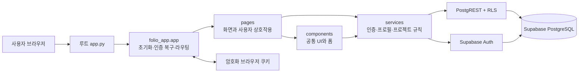
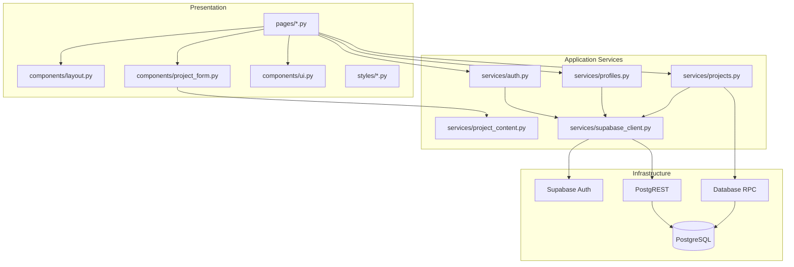
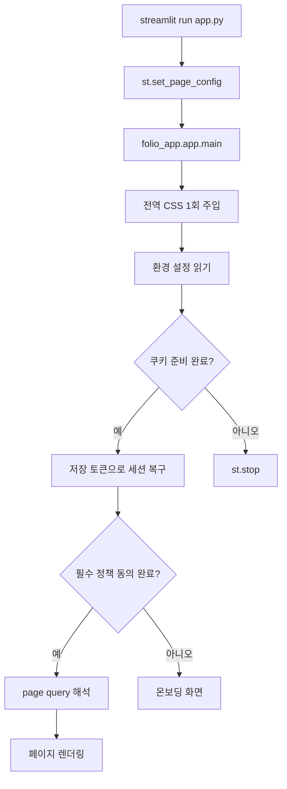
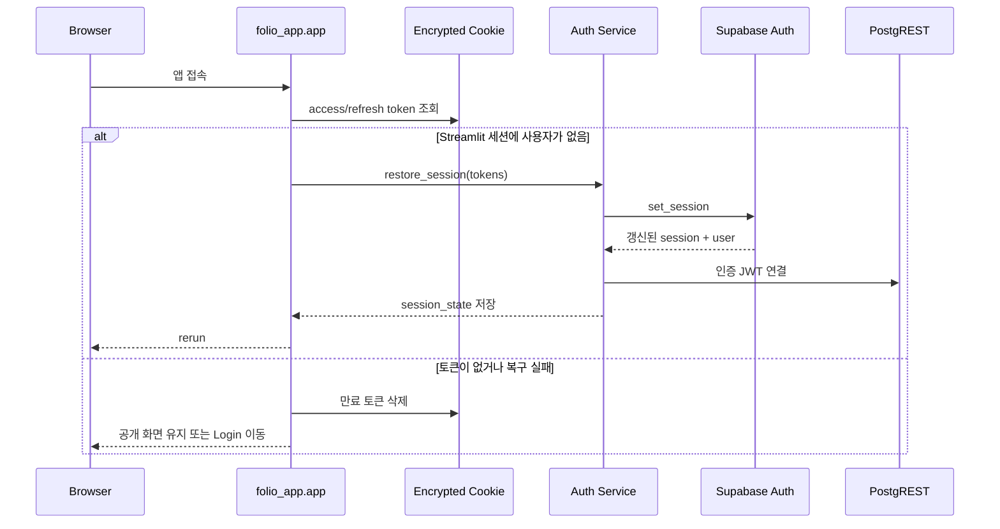
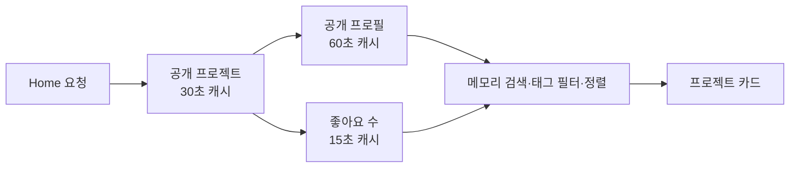

# FOLIO 아키텍처

이 문서는 FOLIO의 실행 구조, 모듈 경계, 인증 상태와 데이터 흐름을 포트폴리오 관점에서 설명한다.

## 1. 시스템 개요

FOLIO는 데이터 분석 프로젝트를 등록·탐색·공유하는 Streamlit 기반 웹 애플리케이션이다. UI와 서버 렌더링은 Streamlit이 담당하고, Supabase가 인증·PostgreSQL·RLS를 제공한다.

## 2. 애플리케이션 계층

| 계층 | 책임 | 금지되는 책임 |
|---|---|---|
| `pages/` | 화면 조합, 입력 수집, 사용자 피드백, 화면 전환 | SQL/RLS 우회, 민감 토큰 직접 관리 |
| `components/` | 반복 UI, 프로젝트 폼, 카드 HTML | 사용자별 데이터 접근 정책 결정 |
| `services/` | 인증, CRUD, 검증, 캐시, 오류 변환 | 페이지 레이아웃과 화면 문구 구성 |
| `styles/` | 디자인 토큰과 영역별 CSS | 비즈니스 상태 판단 |
| Supabase | Auth, 관계형 데이터, RLS, RPC | Streamlit 화면 상태 관리 |

## 3. 실행과 라우팅

파일 기반 멀티페이지 대신 `st.query_params["page"]`를 사용한다. 내부 이동은 `navigation.navigate()`가 query 초기화와 `st.rerun()`을 함께 처리해 Streamlit 세션을 보존한다. 공개 프로젝트 카드 링크만 브라우저 링크를 허용한다.

## 4. 인증과 세션 구조

- 사용자·access token·refresh token은 Streamlit `session_state`에 둔다.
- 브라우저 재접속을 위해 토큰은 암호화 쿠키에도 동기화한다.
- Supabase client는 전역 공유하지 않고 Streamlit 세션별로 생성한다.
- 작성자 전용 mutation 직전 `ensure_authenticated_session()`으로 Auth 세션과 PostgREST JWT를 다시 연결한다.
- 로그아웃 시 세션 토큰, 사용자, Supabase client와 브라우저 쿠키를 함께 폐기한다.

## 5. 데이터 읽기와 캐시

공개 프로젝트 원본을 일정 시간 캐시한 뒤 검색·태그·정렬은 복사본에 적용한다. 프로젝트 CRUD, 조회수 증가, 좋아요 변경 후에는 관련 캐시를 즉시 무효화한다.

## 6. 보안 경계

- 애플리케이션 검증과 별개로 데이터 접근의 최종 권한은 Supabase RLS가 결정한다.
- 공개 프로필은 전체 `profiles` 테이블이 아니라 제한된 `public_profiles` view로 제공한다.
- 프로젝트 본문 HTML은 저장 전과 출력 전 `sanitize_project_html()`로 정제한다.
- 외부 URL은 `http/https`만 허용하고 Power BI iframe에서는 안전한 `src`만 추출한다.
- `service_role` 키를 클라이언트·저장소·배포 Secrets에 사용하지 않는다.

## 7. 배포 단위

Streamlit Community Cloud에서 루트 `app.py`를 실행한다. 데이터베이스 스키마와 RLS는 `supabase/schema.sql`을 Supabase SQL Editor에서 적용한다. 애플리케이션 배포와 DB 정책 적용은 별도 배포 단위이므로 둘 다 확인해야 완료다.
