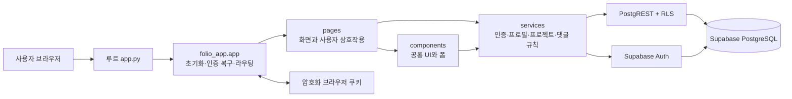
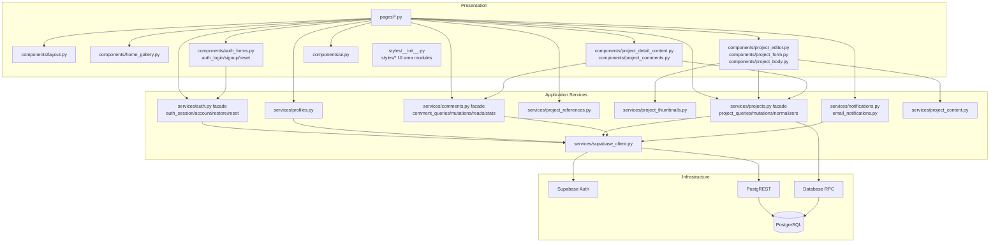
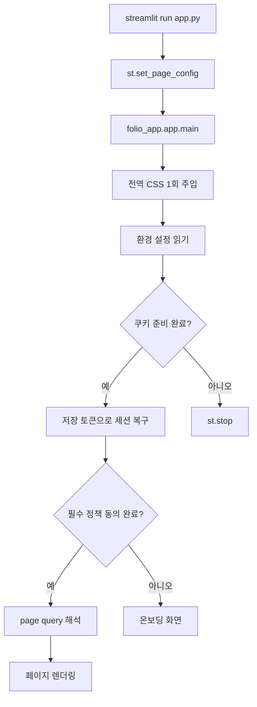
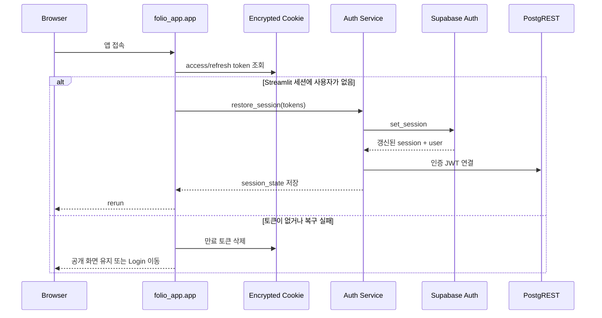
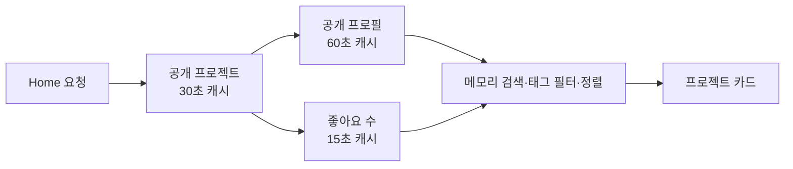

# FOLIO 아키텍처

이 문서는 FOLIO의 실행 구조, 모듈 경계, 인증 상태와 데이터 흐름을 현재 데이터 시각화 커뮤니티 관점에서 설명한다.

## 1. 시스템 개요

FOLIO는 공개 데이터 시각화 레퍼런스와 사용자 등록 프로젝트를 탐색·공유하는 Streamlit 기반 웹 애플리케이션이다. UI와 서버 렌더링은 Streamlit이 담당하고, Supabase가 인증·PostgreSQL·RLS·Storage를 제공한다.

```mermaid
flowchart LR
    User[사용자 브라우저]
    Entry[루트 app.py]
    Coordinator[folio_app.app<br/>초기화·인증 복구·라우팅]
    Pages[pages<br/>화면과 사용자 상호작용]
    Components[components<br/>공통 UI와 폼]
    Services[services<br/>인증·프로필·프로젝트·댓글 규칙]
    Auth[Supabase Auth]
    RLS[PostgREST + RLS]
    DB[(Supabase PostgreSQL)]
    Cookie[암호화 브라우저 쿠키]

    User --> Entry --> Coordinator
    Coordinator --> Pages
    Pages --> Components
    Pages --> Services
    Components --> Services
    Services --> Auth
    Services --> RLS --> DB
    Coordinator <--> Cookie
    Auth --> DB
```

## 2. 애플리케이션 계층

```mermaid
flowchart TB
    subgraph Presentation[Presentation]
        Layout[components/layout.py]
        HomeGallery[components/home_gallery.py]
        Forms[components/project_editor.py<br/>components/project_form.py<br/>components/project_body.py]
        DetailComponents[components/project_detail_content.py<br/>components/project_comments.py]
        AuthComponents[components/auth_forms.py<br/>auth_login/signup/reset]
        UI[components/ui.py]
        PageModules[pages/*.py]
        Styles[styles/__init__.py<br/>styles/* UI area modules]
    end

    subgraph Application[Application Services]
        AuthService[services/auth.py facade<br/>auth_session/account/restore/reset]
        ProfileService[services/profiles.py]
    ProjectService[services/projects.py facade<br/>project_queries/mutations/normalizers]
    ReferenceService[services/project_references.py]
    ThumbnailService[services/project_thumbnails.py]
        CommentService[services/comments.py facade<br/>comment_queries/mutations/reads/stats]
        NotificationService[services/notifications.py<br/>email_notifications.py]
        Sanitizer[services/project_content.py]
        ClientFactory[services/supabase_client.py]
    end

    subgraph Infrastructure[Infrastructure]
        SupabaseAuth[Supabase Auth]
        PostgREST[PostgREST]
        PostgreSQL[(PostgreSQL)]
        RPC[Database RPC]
    end

    PageModules --> Layout
    PageModules --> HomeGallery
    PageModules --> Forms
    PageModules --> DetailComponents
    PageModules --> AuthComponents
    PageModules --> UI
    PageModules --> AuthService
    PageModules --> ProfileService
    PageModules --> ProjectService
    PageModules --> ReferenceService
    PageModules --> CommentService
    PageModules --> NotificationService
    Forms --> Sanitizer
    Forms --> ProjectService
    Forms --> ThumbnailService
    DetailComponents --> ProjectService
    DetailComponents --> CommentService
    AuthComponents --> AuthService
    AuthService --> ClientFactory
    ProfileService --> ClientFactory
    ProjectService --> ClientFactory
    CommentService --> ClientFactory
    NotificationService --> ClientFactory
    ClientFactory --> SupabaseAuth
    ClientFactory --> PostgREST
    PostgREST --> PostgreSQL
    ProjectService --> RPC --> PostgreSQL
```

| 계층 | 책임 | 금지되는 책임 |
|---|---|---|
| `pages/` | 화면 조합, 입력 수집, 사용자 피드백, 화면 전환 | SQL/RLS 우회, 민감 토큰 직접 관리 |
| `components/` | 반복 UI, 인증 폼, 프로젝트 폼, 상세 본문·댓글 UI, 카드 HTML | 사용자별 데이터 접근 정책 결정 |
| `services/` | 인증, CRUD, 댓글·알림, 검증, 캐시, 오류 변환 | 페이지 레이아웃과 화면 문구 구성 |
| `styles/` | 디자인 토큰과 UI 영역별 CSS 모듈 | 비즈니스 상태 판단 |
| Supabase | Auth, 관계형 데이터, RLS, RPC | Streamlit 화면 상태 관리 |

`services/auth.py`, `services/projects.py`, `services/comments.py`는 기존 import 경로를 유지하는 public facade다. 실제 구현은 `auth_*`, `project_*`, `comment_*` 하위 모듈에 둔다. CSS도 `styles/__init__.py`가 영역별 모듈의 `CSS` 상수를 고정 순서로 합쳐 1회 주입한다.

## 3. 실행과 라우팅

```mermaid
flowchart TD
    Start[streamlit run app.py]
    PageConfig[st.set_page_config]
    Main[folio_app.app.main]
    Styles[전역 CSS 1회 주입]
    Settings[환경 설정 읽기]
    Cookies{쿠키 준비 완료?}
    Restore[저장 토큰으로 세션 복구]
    Onboarding{필수 정책 동의 완료?}
    Route[page query 해석]
    Render[페이지 렌더링]

    Start --> PageConfig --> Main --> Styles --> Settings --> Cookies
    Cookies -- 아니오 --> Stop[st.stop]
    Cookies -- 예 --> Restore --> Onboarding
    Onboarding -- 아니오 --> Consent[온보딩 화면]
    Onboarding -- 예 --> Route --> Render
```

파일 기반 멀티페이지 대신 `st.query_params["page"]`를 사용한다. 내부 이동은 `navigation.navigate()`가 query 초기화와 `st.rerun()`을 함께 처리해 Streamlit 세션을 보존한다. 공개 프로젝트 카드 링크와 레퍼런스 카드 링크는 공유 가능한 브라우저 URL을 유지한다.

## 4. 인증과 세션 구조

```mermaid
sequenceDiagram
    participant B as Browser
    participant A as folio_app.app
    participant C as Encrypted Cookie
    participant S as Auth Service
    participant SB as Supabase Auth
    participant P as PostgREST

    B->>A: 앱 접속
    A->>C: access/refresh token 조회
    alt Streamlit 세션에 사용자가 없음
        A->>S: restore_session(tokens)
        S->>SB: set_session
        SB-->>S: 갱신된 session + user
        S->>P: 인증 JWT 연결
        S-->>A: session_state 저장
        A-->>B: rerun
    else 토큰이 없거나 복구 실패
        A->>C: 만료 토큰 삭제
        A-->>B: 공개 화면 유지 또는 Login 이동
    end
```

- 사용자·access token·refresh token은 Streamlit `session_state`에 둔다.
- 브라우저 재접속을 위해 토큰은 암호화 쿠키에도 동기화한다.
- Supabase client는 전역 공유하지 않고 Streamlit 세션별로 생성한다.
- 작성자 전용 mutation 직전 `ensure_authenticated_session()`으로 Auth 세션과 PostgREST JWT를 다시 연결한다.
- 로그아웃 시 세션 토큰, 사용자, Supabase client와 브라우저 쿠키를 함께 폐기한다.

## 5. 데이터 읽기와 캐시

```mermaid
flowchart LR
    Home[Home 요청]
    ProjectCache[공개 프로젝트<br/>30초 캐시]
    ProfileCache[공개 프로필<br/>60초 캐시]
    LikeCache[좋아요 수<br/>15초 캐시]
    Filter[메모리 검색·태그 필터·정렬]
    Cards[프로젝트 카드]

    Home --> ProjectCache
    ProjectCache --> ProfileCache
    ProjectCache --> LikeCache
    ProfileCache --> Filter
    LikeCache --> Filter
    Filter --> Cards
```

공개 프로젝트 원본을 일정 시간 캐시한 뒤 검색·태그·정렬은 복사본에 적용한다. 프로젝트 CRUD, 조회수 증가, 좋아요 변경 후에는 관련 캐시를 즉시 무효화한다.

레퍼런스 목록은 같은 공개 프로젝트 원본에서 태그와 URL marker를 기준으로 플랫폼을 분류한다. `Reference` 페이지는 최초 12개를 렌더링하고, 하단 도달 시 `visible` query parameter를 늘려 같은 Python 렌더 경로에서 다음 묶음을 표시한다. 자동 감지는 Streamlit의 실제 스크롤 컨테이너인 `section.stMain`에 이벤트를 묶고, iframe 안에서 상위 URL을 직접 바꾸지 않는다.

## 6. 보안 경계

- 애플리케이션 검증과 별개로 데이터 접근의 최종 권한은 Supabase RLS가 결정한다.
- 공개 프로필은 전체 `profiles` 테이블이 아니라 제한된 `public_profiles` view로 제공한다.
- 프로젝트 본문 HTML은 저장 전과 출력 전 `sanitize_project_html()`로 정제한다.
- 외부 URL은 `http/https`만 허용하고 Power BI iframe에서는 안전한 `src`만 추출한다.
- `service_role` 키를 클라이언트·저장소·배포 Secrets에 사용하지 않는다.
- 자동 캡처 썸네일은 Selenium/Chromium으로 서버에서 생성하고 Supabase Storage public bucket에 저장한다. 썸네일 모드를 기본 커버나 직접 URL로 바꾸면 기존 자동 캡처 파일을 삭제해 stale 이미지가 남지 않게 한다.

## 7. 배포 단위

Streamlit Community Cloud에서 루트 `app.py`를 실행한다. 데이터베이스 스키마와 RLS는 `supabase/schema.sql`을 Supabase SQL Editor에서 적용한다. 애플리케이션 배포와 DB 정책 적용은 별도 배포 단위이므로 둘 다 확인해야 완료다.
