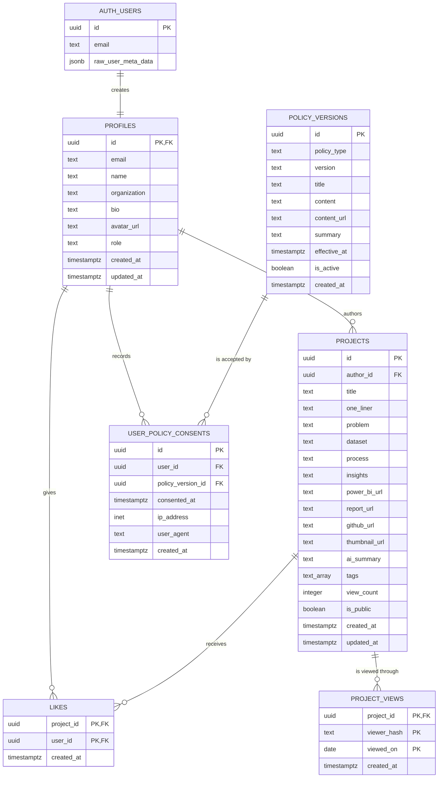
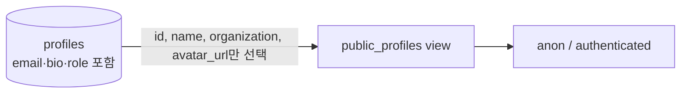
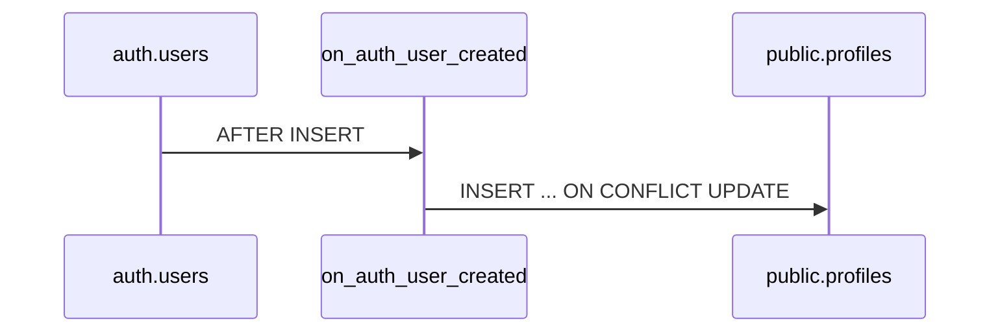

# FOLIO 데이터 모델

이 문서는 Supabase PostgreSQL 스키마의 관계, 주요 제약조건과 RLS 접근 정책을 설명한다. 실제 적용 기준은 `supabase/schema.sql`이다.

## 1. ER 다이어그램

## 2. 핵심 관계와 삭제 규칙

| 부모 | 자식 | 관계 | 삭제 규칙 |
|---|---|---|---|
| `auth.users` | `profiles` | 1:1 | 사용자 삭제 시 profile cascade |
| `profiles` | `projects` | 1:N | profile 삭제 시 프로젝트 cascade |
| `profiles` | `likes` | 1:N | profile 삭제 시 좋아요 cascade |
| `projects` | `likes` | 1:N | 프로젝트 삭제 시 좋아요 cascade |
| `projects` | `project_views` | 1:N | 프로젝트 삭제 시 조회 기록 cascade |
| `profiles` | `user_policy_consents` | 1:N | profile 삭제 시 동의 기록 cascade |
| `policy_versions` | `user_policy_consents` | 1:N | 동의가 있으면 정책 버전 삭제 restrict |

`likes`는 `(project_id, user_id)` 복합 기본키를 사용해 한 사용자가 같은 프로젝트에 중복 좋아요를 만들 수 없게 한다. `project_views`는 `(project_id, viewer_hash, viewed_on)` 복합 기본키로 같은 열람자의 프로젝트별 일간 중복 집계를 막는다. `user_policy_consents`는 `(user_id, policy_version_id)` unique 제약으로 정책 버전별 중복 동의를 막는다.

## 3. 공개 프로필 View

전체 `profiles` 테이블은 본인만 읽을 수 있다. 공개 프로젝트 카드에 필요한 최소 정보는 별도 view로 제한한다.

이름이 비어 있으면 이메일의 `@` 앞부분을 fallback으로 사용하지만 이메일 자체는 view에 노출하지 않는다.

## 4. RLS 정책 행렬

| 리소스 | anon SELECT | authenticated SELECT | INSERT | UPDATE | DELETE |
|---|---|---|---|---|---|
| `profiles` | 불가 | 본인만 | 본인만 | 본인만 | 직접 정책 없음 |
| `public_profiles` | 가능 | 가능 | 불가 | 불가 | 불가 |
| `projects` | 공개 프로젝트 | 공개 + 본인 프로젝트 | 작성자 본인 | 작성자 본인 | 작성자 본인 |
| `likes` | 전체 집계용 읽기 | 전체 읽기 | `user_id = auth.uid()` | 불가 | 본인 좋아요 |
| `project_views` | 직접 접근 불가 | 직접 접근 불가 | RPC만 허용 | 불가 | 불가 |
| `policy_versions` | 활성 버전 | 활성 버전 | 운영 SQL | 운영 SQL | 운영 SQL |
| `user_policy_consents` | 불가 | 본인 기록 | 본인 기록 | 불가 | 불가 |

## 5. 트리거와 RPC

### 사용자 프로필 생성

`auth.users` INSERT 후 `handle_new_user()`가 실행되어 `profiles` row를 생성한다. 이름과 소속은 Auth metadata에서 가져오며 동일 id가 있으면 안전하게 갱신한다.

### 조회수 증가

`increment_project_view_count(uuid, uuid)`는 `security definer` RPC다. 두 번째 인자는 비로그인 브라우저의 무작위 익명 UUID이며 로그인 상태에서는 `auth.uid()`를 우선한다. 로컬 스키마와 원격 Supabase에 모두 적용됐다.

RPC는 다음 순서로 처리한다.

1. 대상이 공개 프로젝트인지 확인한다.
2. 로그인한 작성자 본인의 조회면 집계하지 않는다.
3. 로그인 사용자 ID 또는 익명 UUID를 출처 구분 값과 함께 해시한다.
4. 한국 시간의 현재 날짜로 `project_views`에 INSERT를 시도한다.
5. 복합 기본키 충돌이 없는 최초 INSERT일 때만 `projects.view_count + 1`을 수행한다.

RPC는 집계 여부를 boolean으로 반환한다. 앱은 실패와 정상적인 중복 미집계를 구분해 처리하며, DB에는 원본 사용자 ID·익명 UUID·IP·User-Agent를 조회 기록으로 저장하지 않는다.

## 6. 인덱스

- `projects(author_id)`: My Page의 작성자별 목록
- `projects(created_at desc)`: 최신순 탐색
- `likes(user_id)`: 사용자 좋아요 조회
- `project_views(project_id, viewed_on)`: 프로젝트별 조회 기록 관리와 기간 조회
- `policy_versions(policy_type, is_active, effective_at desc)`: 활성 정책 선택
- `user_policy_consents(user_id)`: 온보딩 완료 검사
- `user_policy_consents(policy_version_id)`: 정책별 동의 추적

## 7. 모델링 원칙

- 카테고리 컬럼 대신 `tags text[]`로 탐색 축을 단순화한다.
- 좋아요 수는 중복 저장하지 않고 `likes` 관계에서 계산한다.
- 조회수 합계는 읽기 성능을 위해 `projects.view_count`에 유지하고, 일간 중복 여부는 `project_views`가 판정한다.
- 정책 본문과 사용자 동의를 버전별로 분리해 이후 약관 개정에도 이력을 보존한다.
