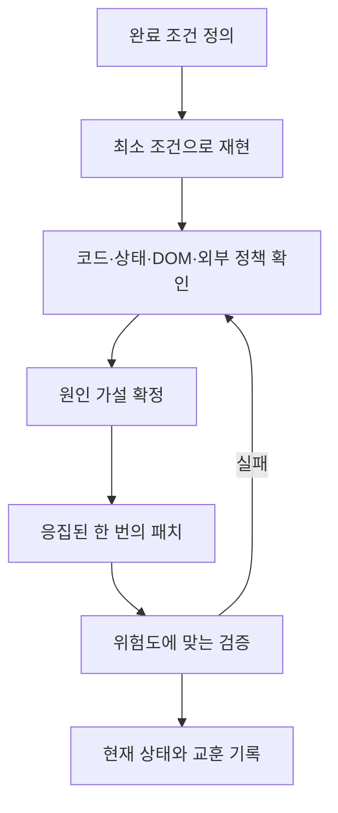

# FOLIO 엔지니어링 플레이북

이 문서는 FOLIO를 개발하며 합의한 규칙과 시행착오에서 얻은 교훈을 정리한다. 새 기능보다 일관성·보안·진단 가능성을 우선하며, 다음 작업자는 이 문서를 기본 작업 정책으로 사용한다.

## 1. 핵심 원칙

1. **권한은 UI가 아니라 RLS로 완성한다.** 버튼을 숨기는 것은 UX일 뿐 보안 경계가 아니다.
2. **상태 변경 전 인증을 다시 확인한다.** `session_state`의 사용자와 PostgREST JWT는 별개로 만료될 수 있다.
3. **Streamlit rerun을 정상 동작으로 설계한다.** 입력, query, 쿠키와 일회성 메시지가 rerun 뒤에도 예측 가능해야 한다.
4. **완료 조건을 먼저 수치화한다.** 크기·정렬·여백은 DOM 좌표와 computed style로 확인한다.
5. **작은 패치가 세 번 실패하면 접근 방식을 바꾼다.** 보정값을 계속 쌓지 않고 구조를 다시 본다.
6. **코드와 문서가 다르면 코드를 확인한 뒤 문서를 즉시 고친다.**

## 2. 코드 소유권

| 변경 내용 | 우선 수정 위치 |
|---|---|
| 화면 문구·화면 조합 | `folio_app/pages/` |
| 반복 UI·프로젝트 폼 | `folio_app/components/` |
| 인증·CRUD·검증·캐시 | `folio_app/services/` |
| 색상·간격·반응형 | `folio_app/styles/` |
| 테이블·RLS·RPC | `supabase/schema.sql` |
| 현재 상태와 작업 규칙 | `docs/PROJECT_CONTEXT.md`와 본 문서 |

페이지가 Supabase query를 직접 만들거나 서비스가 Streamlit 레이아웃을 렌더링하지 않는다.

## 3. 인증과 세션 정책

- Auth 상태를 가진 Supabase client는 전역 cache에 넣지 않는다.
- 보호 mutation 전 `ensure_authenticated_session()`을 호출한다.
- 갱신된 access token을 `client.postgrest.auth()`에 명시 적용한다.
- 복구 실패 시 공개 페이지는 조용히 계속하고 보호 페이지는 Login으로 보낸다.
- 로그아웃은 사용자·토큰·client·브라우저 쿠키를 함께 정리한다.
- 인증 오류 원문과 RLS 정책 오류를 같은 문제로 오진하지 않는다.
- 이메일, 비밀번호, token, API key는 로그·문서·스크린샷에 기록하지 않는다.

## 4. 데이터와 RLS 정책

- `service_role` 키를 앱과 배포 환경에 넣지 않는다.
- 작성자는 자신의 프로젝트만 생성·수정·삭제할 수 있어야 한다.
- anon 사용자는 공개 프로젝트만 읽는다.
- 공개 프로필은 `public_profiles` view의 최소 정보만 사용한다.
- 프로젝트 공개→비공개 UPDATE는 `return=minimal`로 성공을 판정한다. 변경 직후 representation SELECT는 RLS와 충돌할 수 있다.
- 원격 RLS 변경은 로컬 테스트 통과만으로 완료 처리하지 않는다. Supabase 적용과 실제 계정 검증이 필요하다.
- 스키마 파일은 반복 실행 가능하도록 `if not exists`, `drop policy if exists`, upsert 패턴을 유지한다.

## 5. 입력과 콘텐츠 보안

- 프로젝트 본문은 저장 전과 출력 전에 모두 `sanitize_project_html()`을 통과시킨다.
- 외부 URL은 `http://` 또는 `https://`만 허용한다.
- Power BI iframe 전체 입력을 받더라도 `src` URL만 추출해 저장한다.
- 사용자 문자열을 HTML에 넣을 때 `html.escape()`를 사용한다.
- 여러 줄 HTML을 `st.markdown()`으로 렌더링할 때 들여쓰기로 코드 블록이 생기지 않도록 `clean_html()` 또는 한 줄 조합을 사용한다.

## 6. Streamlit 상태와 이동 정책

- 내부 이동은 `navigate()`를 사용한다.
- 인증 상태나 데이터를 변경하는 동작에는 HTML `<a>`를 사용하지 않는다.
- 성공 메시지는 `session_state`에 임시 저장해 rerun 뒤 한 번 표시한다.
- 상세 조회수는 `viewed_<project_id>` 세션 key로 중복 증가를 막는다.
- 위젯 key는 페이지와 역할을 드러내도록 안정적으로 작성한다.
- query parameter를 변경할 때 이전 화면의 불필요한 값을 정리한다.

## 7. CSS와 반응형 정책

- 전역 선택자보다 `.st-key-*` 컨테이너 스코프를 우선한다.
- 새 선택자를 추가하기 전에 실제 Python 렌더링 클래스와 key를 검색한다.
- Streamlit 내부 emotion class처럼 버전마다 바뀌는 클래스에 의존하지 않는다.
- `st.columns()` 내부 래퍼를 추측하지 말고 필요하면 DOM을 측정한다.
- PC 기본 검증은 1440×900, 모바일은 390×844로 한다.
- PC의 2·3열 입력 폼은 모바일에서 1열로 전환한다.
- 모바일 버튼 텍스트가 줄마다 한 글자씩 꺾이지 않는지 확인한다.
- 모든 primary 버튼은 파란 배경·흰 글자로 구분하되, 좋아요처럼 문맥별 스타일이 있는 버튼은 더 구체적인 선택자로 오버라이드한다.
- 전역 CSS는 `st.html()`의 style-only 콘텐츠로 한 번 주입한다. 인증 rerun 중 스타일이 사라지는 플래시를 줄이기 위함이다.

## 8. UI/UX 정책

- 한 화면에는 하나의 명확한 primary action을 둔다.
- 정보성 수치는 버튼처럼 보이지 않게 하고 실제 상호작용만 버튼으로 표현한다.
- 빈 공간을 장식으로 채우기보다 정보 위계와 그룹을 조정한다.
- 같은 데이터의 조회·관리는 가능한 한 한 화면에 모은다.
- 한글 문구는 `word-break: keep-all`과 적절한 `max-width`를 사용한다.
- 비어 있는 상태, 로딩 실패, 실제 데이터 없음은 서로 다른 메시지와 재시도 흐름을 제공한다.
- 모바일 임베드 콘텐츠는 내부 스크롤과 화면 길이를 확인하고 필요하면 외부 열기 중심으로 단순화한다.

## 9. 캐시 정책

- 캐시된 원본 row를 직접 수정하지 않는다. 필터·정렬 전 복사한다.
- 프로젝트 CRUD, 조회수, 좋아요 변경 후 관련 캐시를 비운다.
- 인기 태그처럼 같은 원본에서 계산할 수 있는 값은 추가 DB 요청을 만들지 않는다.
- 캐시 TTL은 성능과 최신성의 의도적 절충이며 변경 이유를 문서에 남긴다.

## 10. 진단 순서



### UI 문제

1. 캡처로 증상을 확인한다.
2. 1차 수정이 다르면 `getBoundingClientRect()`와 computed style을 측정한다.
3. 버튼은 `stElementContainer → stButton → stTooltipHoverTarget → button` 전체를 확인한다.
4. 2~4px 보정을 반복하기 전에 flex/grid 구조와 실제 폭을 확인한다.

### 인증·RLS 문제

1. `session_state` 사용자 존재 여부를 확인한다.
2. Supabase Auth session을 확인한다.
3. PostgREST에 JWT가 연결됐는지 확인한다.
4. 원격 RLS 정책이 최신인지 확인한다.
5. 실제 테스트 계정으로 공개↔비공개와 작성자 권한을 검증한다.

## 11. 검증 기준

| 변경 위험도 | 최소 검증 |
|---|---|
| 문구·단순 CSS | 변경 파일 확인, 필요 시 한 화면 캡처 |
| Python 화면 흐름 | `py_compile` + 관련 단위 테스트 |
| 공통 서비스·인증 | 관련 테스트 + 전체 테스트 |
| DB payload·RLS | 전체 테스트 + 실제 Supabase 계정 검증 |
| 큰 UI 재구성 | PC·모바일 캡처 + 핵심 액션 직접 실행 |

기본 명령:

```powershell
python -m unittest discover -s tests -v
python -m compileall -q app.py folio_app tests
```

## 12. 완료 정의

작업은 다음 조건을 만족해야 완료다.

- 요청한 사용자 결과가 실제 화면 또는 데이터에 반영됐다.
- 관련 오류·빈 상태·모바일 화면을 고려했다.
- 위험도에 맞는 테스트가 통과했다.
- 임시 캡처·진단 스크립트를 정리했다.
- 원격 SQL이나 배포 설정이 필요하면 로컬 완료와 구분해 알렸다.
- 구조·라우트·정책이 바뀌면 README와 관련 docs를 갱신했다.

## 13. 주요 교훈

- **세션 사용자가 있다고 API도 인증된 것은 아니다.** Auth와 PostgREST 상태를 분리해서 본다.
- **CSS가 적용됐다는 것과 원하는 요소가 움직였다는 것은 다르다.** 실제 좌표를 측정한다.
- **Streamlit 컨테이너 문맥과 브라우저 DOM 중첩은 항상 같지 않다.** key만 믿지 말고 렌더 결과를 확인한다.
- **오래된 서버 프로세스는 최신 코드를 가릴 수 있다.** 8501 리스너가 하나인지 확인한다.
- **문서 드리프트도 결함이다.** 현재 동작을 설명하지 못하는 문서는 다음 작업의 진입 비용을 높인다.
- **프레임워크 한계를 인정하는 것도 설계다.** 작은 시각 보정을 위해 복잡하고 깨지기 쉬운 CSS를 쌓지 않는다.
