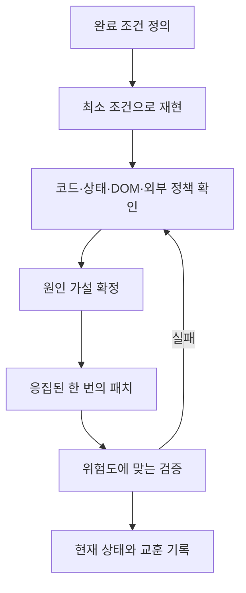

# FOLIO 엔지니어링 플레이북

이 문서는 FOLIO를 개발하며 합의한 규칙과 시행착오에서 얻은 교훈을 정리한다. 새 기능보다 일관성·보안·진단 가능성을 우선하며, 다음 작업자는 이 문서를 기본 작업 정책으로 사용한다.

## 1. 핵심 원칙

1. **권한은 UI가 아니라 RLS로 완성한다.** 버튼을 숨기는 것은 UX일 뿐 보안 경계가 아니다.
2. **상태 변경 전 인증을 다시 확인한다.** `session_state`의 사용자와 PostgREST JWT는 별개로 만료될 수 있다.
3. **Streamlit rerun을 정상 동작으로 설계한다.** 입력, query, 쿠키와 일회성 메시지가 rerun 뒤에도 예측 가능해야 한다.
4. **완료 조건을 먼저 수치화한다.** 크기·정렬·여백은 DOM 좌표와 computed style로 확인한다.
5. **작은 패치가 세 번 실패하면 접근 방식을 바꾼다.** 보정값을 계속 쌓지 않고 구조를 다시 본다.
6. **코드와 문서가 다르면 코드를 확인한 뒤 문서를 즉시 고친다.**
7. **사용자가 범위를 다시 잡으면 그 범위에서 멈춘다.** 문서 업데이트, 테스트, 커밋, 푸시, 이슈 코멘트는 각각 별도 단계다. 한 단계를 끝냈다고 다음 단계를 자동으로 실행하지 않는다.

### AI 협업과 컨텍스트 관리

- 새 작업 컨텍스트에서는 `docs/PROJECT_CONTEXT.md`와 본 문서를 먼저 읽는다.
- 이후에는 현재 요청과 직접 관련된 설계 문서와 코드만 추가로 확인한다.
- 내부 분석과 코드 탐색은 영어로 진행하고, 사용자에게 보여주는 설명·질문·결과는 한국어로 작성한다.
- 같은 내용을 반복하거나 불필요한 중간 출력을 만들지 않고, 판단 근거와 결과를 간결하게 전달한다.
- 특정 언어의 고정된 토큰 절감률을 전제로 삼지 않는다. 필요한 정보만 선택적으로 읽고 출력하는 것을 우선한다.
- 기본 작업 스타일은 **Ponytail + Caveman**이다. Ponytail은 코드에 적용하고, Caveman은 사용자-facing 설명에 적용한다.
- Ponytail: 가장 작은 동작 변경을 우선한다. 기존 코드·표준 라이브러리·프레임워크 native 기능을 먼저 쓰고, 새 dependency·새 abstraction·미래 확장용 옵션은 실제 필요가 있을 때만 추가한다.
- Caveman: 결과 보고는 짧게, 결론 먼저, 개조식으로, 군더더기 없이 쓴다. 다만 보안, 데이터 손실, 배포, 검증 실패, 사용자 승인 필요 사항은 생략하지 않는다.
- Ponytail이 검증·보안·접근성·오류 처리를 줄이는 핑계가 되면 안 된다. 줄일 대상은 불필요한 구조와 설명이지, 안전장치가 아니다.
- 작업 시작 전 이번 턴의 범위를 한 문장으로 고정한다. 사용자가 중간에 "문서 업데이트해야지", "검증은 생략하자"처럼 범위를 수정하면 기존 흐름을 폐기하고 새 범위만 수행한다.
- 범위가 `문서 업데이트`라면 문서만 고치고 멈춘다. 테스트·커밋·푸시·이슈 처리는 사용자가 다시 명시하기 전까지 실행하지 않는다.
- "진행해"는 직전 문맥의 좁은 작업에만 적용한다. 직전 문맥이 문서라면 문서만, 테스트라면 테스트만, 커밋이라면 커밋만 의미한다.
- 다음 단계가 자연스럽게 보여도 실행하지 말고 사용자에게 확인한다. 예: "문서 반영은 끝났고, 다음은 테스트인데 진행할까요?"

## 2. 코드 소유권

| 변경 내용 | 우선 수정 위치 |
|---|---|
| 화면 문구·화면 조합 | `folio_app/pages/` |
| 반복 UI·프로젝트 폼 | `folio_app/components/` |
| 인증·CRUD·검증·캐시 | `folio_app/services/` |
| 색상·간격·반응형 | `folio_app/styles/` |
| 테이블·RLS·RPC | `supabase/schema.sql` |
| 현재 상태와 작업 규칙 | `docs/PROJECT_CONTEXT.md`와 본 문서 |

페이지가 Supabase query를 직접 만들거나 서비스가 Streamlit 레이아웃을 렌더링하지 않는다.

### 리팩토링 후 모듈 경계

- `folio_app/services/auth.py`, `projects.py`, `comments.py`는 public facade다. 기존 페이지·테스트 import 경로를 깨지 않도록 public API를 re-export하고, 실제 구현은 `auth_*`, `project_*`, `comment_*` 하위 모듈에 둔다.
- 새 인증 기능은 계정 작업이면 `auth_account.py`, 세션·토큰이면 `auth_session.py`, 쿠키 복구면 `auth_restore.py`, 비밀번호 재설정이면 `auth_password_reset.py`에 추가한다.
- 새 프로젝트 조회·검색·캐시 로직은 `project_queries.py`, 생성·수정·삭제·좋아요·조회수 변경은 `project_mutations.py`, payload/URL/태그 정규화는 `project_normalizers.py`에 둔다.
- 새 댓글 조회 로직은 `comment_queries.py`, 작성·삭제는 `comment_mutations.py`, 읽음 상태는 `comment_reads.py`, 댓글 수·최신 댓글 시각 캐시는 `comment_stats.py`, 트리/시간 변환 유틸은 `comment_utils.py`에 둔다.
- `components/auth_forms.py`는 인증 UI facade다. 로그인/회원가입/비밀번호 재설정 화면 구현은 각각 `auth_login.py`, `auth_signup.py`, `auth_password_reset.py`, 입력·정책 검증은 `auth_validation.py`에 둔다.
- 프로젝트 등록·수정 흐름은 `project_editor.py`, 공용 입력 폼은 `project_form.py`, Quill 본문 파싱은 `project_body.py`가 맡는다. 상세 대표 결과물/본문은 `project_detail_content.py`, 댓글 UI는 `project_comments.py`, 홈 카드 레일은 `home_gallery.py`에 둔다.
- Power BI 콘텐츠 화면은 `pages/powerbi.py`에 두되 CSV 로딩, 그룹핑, 뉴스 아이템 병합은 `services/powerbi_content.py`, 한국어 요약·라벨 규칙은 `services/powerbi_i18n.py`에 둔다. 새 수집원을 추가하면 `tools/collect_powerbi_all.py`의 `Collector` registry와 `docs/curation/powerbi_CONTENT_OPS.md`를 함께 갱신한다.
- 테스트가 과거 facade의 private helper를 patch하고 있다면 먼저 public 동작으로 바꿀 수 있는지 본다. 불가피하게 내부를 patch해야 하면 실제 구현 모듈을 patch한다.

## 3. 인증과 세션 정책

- Auth 상태를 가진 Supabase client는 전역 cache에 넣지 않는다.
- 보호 mutation 전 `ensure_authenticated_session()`을 호출한다.
- 갱신된 access token을 `client.postgrest.auth()`에 명시 적용한다.
- 복구 실패 시 공개 페이지는 조용히 계속하고 보호 페이지는 Login으로 보낸다.
- 로그아웃은 사용자·토큰·client·브라우저 쿠키를 함께 정리한다.
- 인증 오류 원문과 RLS 정책 오류를 같은 문제로 오진하지 않는다.
- 이메일, 비밀번호, token, API key는 로그·문서·스크린샷에 기록하지 않는다.

## 4. 데이터와 RLS 정책

- `service_role` 키는 서버 전용으로만 사용한다. 클라이언트, DB, 로그, 화면, 사용자 다운로드 경로에 노출하지 않는다.
- 작성자는 자신의 프로젝트만 생성·수정·삭제할 수 있어야 한다.
- anon 사용자는 공개 프로젝트만 읽는다.
- 공개 프로필은 `public_profiles` view의 최소 정보만 사용한다.
- 프로젝트 공개→비공개 UPDATE는 `return=minimal`로 성공을 판정한다. 변경 직후 representation SELECT는 RLS와 충돌할 수 있다.
- 원격 RLS 변경은 로컬 테스트 통과만으로 완료 처리하지 않는다. Supabase 적용과 실제 계정 검증이 필요하다.
- 스키마 파일은 반복 실행 가능하도록 `if not exists`, `drop policy if exists`, upsert 패턴을 유지한다.

## 5. 입력과 콘텐츠 보안

- 프로젝트 본문은 저장 전과 출력 전에 모두 `sanitize_project_html()`을 통과시킨다.
- 외부 URL은 `http://` 또는 `https://`만 허용한다.
- Power BI iframe 전체 입력을 받더라도 `src` URL만 추출해 저장한다.
- 사용자 문자열을 HTML에 넣을 때 `html.escape()`를 사용한다.
- 여러 줄 HTML을 `st.markdown()`으로 렌더링할 때 들여쓰기로 코드 블록이 생기지 않도록 `clean_html()` 또는 한 줄 조합을 사용한다.
- `st.markdown(..., unsafe_allow_html=True)`에 조각 HTML을 중첩 삽입할 때는 최종 출력 문자열을 확인한다. 여러 줄 속성을 가진 ``처럼 Markdown 렌더러가 블록을 오해할 수 있는 태그는 한 줄 HTML로 조합하거나 `clean_html()`을 통과시킨다.

### 오류 메시지와 진단 로그

- Supabase·PostgREST 등 외부 공급자의 예외 원문은 서버 로그에만 남기고 사용자 화면에는 고정된 안전 메시지를 표시한다.
- 데이터 없음, 좋아요 0건 같은 정상 상태와 조회 실패를 같은 `None`, `False`, 빈 목록으로 합치지 않는다.
- 화면에서 처리해야 하는 실패는 `ProjectServiceError`, `ProfileServiceError`처럼 서비스별 예외로 변환한다.
- 재시도 버튼은 필요한 캐시를 비운 뒤 rerun하며, 실패한 작업을 완료 상태로 기록하지 않는다.
- 예상 가능한 사용자 오류와 운영 장애를 구분한다. 인증 정보 불일치는 안내 메시지로, 네트워크·RLS·공급자 장애는 로그와 재시도 흐름으로 처리한다.

## 6. Streamlit 상태와 이동 정책

- 내부 이동은 `navigate()`를 사용한다.
- 인증 상태나 데이터를 변경하는 동작에는 HTML `<a>`를 사용하지 않는다.
- 성공 메시지는 `session_state`에 임시 저장해 rerun 뒤 한 번 표시한다.
- 상세 조회수는 `viewed_<project_id>` 세션 key로 중복 증가를 막는다.
- 위젯 key는 페이지와 역할을 드러내도록 안정적으로 작성한다.
- query parameter를 변경할 때 이전 화면의 불필요한 값을 정리한다.
- 프로젝트 초안은 `사용자 ID + submit/edit:프로젝트 ID` 단위로 분리해 현재 `session_state`에 저장한다.
- 초안은 등록·수정 성공, 수정 취소, 사용자의 명시적 초기화 때만 삭제한다.
- 렌더된 위젯 key는 같은 실행에서 삭제하지 않는다. 삭제 요청을 기록하고 다음 rerun의 위젯 렌더 전 정리한다.
- 세션 초안은 브라우저 하드 리로드나 종료 이후까지 보장하지 않으며 인증 정보는 저장하지 않는다.

## 7. CSS와 반응형 정책

- 전역 선택자보다 `.st-key-*` 컨테이너 스코프를 우선한다.
- 새 선택자를 추가하기 전에 실제 Python 렌더링 클래스와 key를 검색한다.
- Streamlit 내부 emotion class처럼 버전마다 바뀌는 클래스에 의존하지 않는다.
- `st.columns()` 내부 래퍼를 추측하지 말고 필요하면 DOM을 측정한다.
- `.st-key-*`가 실제로 어느 DOM 노드에 붙는지 확인한다. key class가 target 요소 자체에 붙은 경우와 조상/자손에 붙은 경우는 selector가 다르다. 예: `.st-key-x[data-testid="stHorizontalBlock"]`와 `.st-key-x [data-testid="stHorizontalBlock"]`는 완전히 다르며, 틀리면 CSS가 조용히 무시된다.
- PC 기본 검증은 1440×900, 모바일은 390×844로 한다.
- PC의 2·3열 입력 폼은 모바일에서 1열로 전환한다.
- 모바일 버튼 텍스트가 줄마다 한 글자씩 꺾이지 않는지 확인한다.
- 모든 primary 버튼은 파란 배경·흰 글자로 구분하되, 좋아요처럼 문맥별 스타일이 있는 버튼은 더 구체적인 선택자로 오버라이드한다.
- 전역 CSS는 `st.html()`의 style-only 콘텐츠로 한 번 주입한다. 인증 rerun 중 스타일이 사라지는 플래시를 줄이기 위함이다.
- `folio_app/styles/__init__.py`만 CSS 모듈을 조합한다. 페이지·컴포넌트에서 개별 style module을 직접 import하지 않는다.
- 새 CSS는 가장 가까운 UI 영역 모듈의 `CSS` 상수에 넣는다. 새 모듈을 만들면 반드시 `_SECTIONS`에 추가하고, 순서가 cascade 결과에 영향을 주는지 확인한다.
- 홈 카드 본체는 `cards.py`, 자동 커버는 `project_card_cover.py`, 카드 레일은 `gallery_rail.py`에 둔다. 상세 대표 결과물은 `project_detail_content.py`, 댓글은 `project_comments.py`, 상세 footer 액션 정렬은 `hero_footer.py`에 둔다.
- **`styles/*.py`의 CSS 문자열(주석 포함)에 `<a>`, `<div>` 같은 리터럴 태그 형태 텍스트를 쓰지 않는다.** `apply_global_styles()`가 모든 모듈을 이어붙여 `st.html()`로 한 번에 주입하는데, 이 문자열 안에 실제 태그 형태 텍스트가 있으면(주석이라도) 그 지점부터 스타일시트 전체가 깨질 수 있다. 태그를 설명해야 하면 "anchor", "div" 같은 단어로 풀어 쓴다. CSS 변경 후 `folio_app.styles._SECTIONS`를 이어붙인 최종 문자열에 리터럴 태그가 남아있지 않은지 확인한다(문법 오류가 아니라서 `py_compile`/유닛테스트로는 못 잡는다).
- **Streamlit의 마크다운 렌더러는 `<a>`가 블록 요소(`<div>` 등)를 감싸는 걸 허용하지 않는다.** 하나의 `<a>`로 `<div>`를 감싸면, 렌더러가 이를 텍스트 조각(각 인라인 런)별로 여러 개의 작은 `<a>`로 쪼개버려서, `<div>`로 감싸진 배경·이미지 영역은 어떤 링크에도 속하지 못해 클릭이 안 된다. 카드 전체를 클릭 가능하게 만들어야 하면, 카드를 감싸지 말고 `position: absolute; inset: 0;`로 카드 위에 빈 오버레이 `<a>`를 얹는 "stretched link" 패턴을 쓴다(`folio_app/components/ui.py`의 `render_project_card_html()` 참고). 오버레이의 `z-index`는 카드 내부에서 가장 높은 `z-index`보다 확실히 높게 잡는다(동점이면 나중에 그려지는 요소가 클릭을 가로챌 수 있다).
- 카드 hover 테두리는 카드 자체 border보다 `::after` 오버레이로 처리한다. 썸네일, 그라데이션, stretched link가 카드 표면을 덮기 때문에 base border만 바꾸면 화면에서 안 보일 수 있다.

## 8. UI/UX 정책

- 한 화면에는 하나의 명확한 primary action을 둔다.
- 정보성 수치는 버튼처럼 보이지 않게 하고 실제 상호작용만 버튼으로 표현한다.
- 빈 공간을 장식으로 채우기보다 정보 위계와 그룹을 조정한다.
- 같은 데이터의 조회·관리는 가능한 한 한 화면에 모은다.
- 한글 문구는 `word-break: keep-all`과 적절한 `max-width`를 사용한다.
- 비어 있는 상태, 로딩 실패, 실제 데이터 없음은 서로 다른 메시지와 재시도 흐름을 제공한다.
- 모바일 임베드 콘텐츠는 내부 스크롤과 화면 길이를 확인하고 필요하면 외부 열기 중심으로 단순화한다.

## 9. Streamlit 브라우저 테스트 체크리스트

- in-app browser 세션이 없으면 곧바로 로컬 Chrome/Selenium으로 대체하되, 먼저 `localhost:8501` 서버와 포트 중복 여부를 확인한다.
- 스크롤 문제는 `window.scrollY`를 기준으로 단정하지 않는다. `section.stMain`, `[data-testid="stMain"]`, `.block-container` 등 실제 스크롤 가능한 요소의 `scrollHeight`, `clientHeight`, `scrollTop`을 먼저 측정한다.
- sentinel 기반 무한스크롤은 sentinel의 `getBoundingClientRect()`와 실제 스크롤 컨테이너 위치를 함께 기록한다.
- `components.html` 스크립트는 iframe sandbox 안에서 실행된다. 상위 페이지 URL 변경, top navigation, 직접 reload는 브라우저 정책에 막힐 수 있으므로 Streamlit 버튼 클릭, query param 콜백, `st.rerun()`처럼 앱 내부 동작을 태운다.
- 자동 로딩과 수동 fallback 버튼은 같은 Python 콜백을 공유하게 만든다. 둘이 별도 상태를 가지면 남은 개수, 버튼 노출, 마지막 상태가 쉽게 어긋난다.
- 브라우저 로그에서 `Unsafe attempt to initiate navigation`, `sandbox`, iframe 관련 오류가 보이면 JavaScript 권한 문제가 원인 후보 1순위다.
- 완료 검증은 시작 상태, 1회 로딩 후 상태, 마지막 상태를 모두 남긴다. 예: 카드 수, URL query, sentinel 문구, fallback 버튼 존재 여부.

## 10. 캐시 정책

- 캐시된 원본 row를 직접 수정하지 않는다. 필터·정렬 전 복사한다.
- 프로젝트 CRUD, 조회수, 좋아요 변경 후 관련 캐시를 비운다.
- 인기 태그처럼 같은 원본에서 계산할 수 있는 값은 추가 DB 요청을 만들지 않는다.
- 캐시 TTL은 성능과 최신성의 의도적 절충이며 변경 이유를 문서에 남긴다.

## 11. 진단 순서


```mermaid
flowchart TD
    Define[완료 조건 정의]
    Reproduce[최소 조건으로 재현]
    Inspect[코드·상태·DOM·외부 정책 확인]
    Cause[원인 가설 확정]
    Patch[응집된 한 번의 패치]
    Verify[위험도에 맞는 검증]
    Document[현재 상태와 교훈 기록]

    Define --> Reproduce --> Inspect --> Cause --> Patch --> Verify --> Document
    Verify -- 실패 --> Inspect
```

### UI 문제

1. 캡처로 증상을 확인한다.
2. 1차 수정이 다르면 `getBoundingClientRect()`와 computed style을 측정한다.
3. 버튼은 `stElementContainer → stButton → stTooltipHoverTarget → button` 전체를 확인한다.
4. 같은 UI 문제를 두 번 이상 수정했는데 재발하면 다음 패치 전에 반드시 DOM을 계측한다. 최소한 문제 요소, 부모 wrapper, 형제 요소의 `getBoundingClientRect()`, `display`, `flex`, `width`, `min-width`, `margin-left`, `justify-content`, selector 매치 여부를 출력한다.
5. Streamlit UI는 Python의 `st.columns()` 비율, `st.container(key=...)`, custom component iframe, 실제 DOM wrapper가 함께 만든 결과다. 정렬이 어긋날 때 CSS 값만 바꾸면 다른 wrapper가 그대로 남아 효과가 없어 보일 수 있으므로, 렌더 구조와 wrapper를 먼저 확인한다.
6. 같은 줄처럼 보이는 요소는 실제로도 같은 flex/grid 컨테이너 안에 있어야 한다. 조회수, 공개 상태, 링크 복사, 좋아요처럼 한 묶음으로 읽히는 요소를 여러 column/context에 흩어놓으면 gap과 vertical alignment가 계속 따로 논다.
7. hover 확대, iframe preview, transform 같은 강한 인터랙션은 기본값으로 두지 않는다. 홈/레퍼런스 카드는 약한 transition과 테두리 강조만 쓰고, 등록 페이지 카드 미리보기와 상세 썸네일은 같은 클래스를 공유하더라도 추가 동작이 번지지 않게 scope를 확인한다.
8. 보이는 UI를 custom component iframe에 넣고 Streamlit button과 한 줄에 섞는 구조는 마지막 수단이다. iframe viewport는 바깥 overflow를 보여줄 수 없어 폭 계산이 조금만 틀려도 clipping이 생긴다. 보이는 칩/버튼은 가능하면 페이지 DOM에 렌더링하고, iframe은 script bridge처럼 보이지 않는 기능에만 쓴다.
9. Streamlit `horizontal=True` 컨테이너를 쓸 때는 실제 DOM에서 key class가 `stHorizontalBlock` 자체에 붙는지 확인한다. key class가 같은 노드에 붙었다면 selector는 `.st-key-name[data-testid="stHorizontalBlock"]` 형태여야 한다.
10. 이미지 정렬 문제는 DOM 박스 좌표와 실제 이미지 비율을 분리해 본다. `object-fit: contain`과 고정 `width`를 함께 쓰면 PNG 내부 여백이 없어도 이미지 박스 안에 시각적 여백이 생긴다. 오른쪽 기준선에 맞춰야 하는 로고는 `width: auto`, `max-width`, `max-height` 조합을 우선한다.

### 인증·RLS 문제

1. `session_state` 사용자 존재 여부를 확인한다.
2. Supabase Auth session을 확인한다.
3. PostgREST에 JWT가 연결됐는지 확인한다.
4. 원격 RLS 정책이 최신인지 확인한다.
5. 실제 테스트 계정으로 공개↔비공개와 작성자 권한을 검증한다.

## 12. 검증 기준

| 변경 위험도 | 최소 검증 |
|---|---|
| 문구·라벨·단순 CSS | 변경 파일 확인. 테스트·캡처는 생략 |
| Python 화면 흐름 | `py_compile` + 관련 단위 테스트 |
| 공통 서비스·인증 | 관련 테스트 + 전체 테스트 |
| DB payload·RLS | 전체 테스트 + 실제 Supabase 계정 검증 |
| 큰 UI 재구성 | PC·모바일 캡처 + 핵심 액션 직접 실행 |

단순 문구 변경, 메뉴 라벨 변경, 작은 스타일 조정처럼 영향 범위가 명확한 수정은 과검증하지 않는다. 인증·권한·DB·라우팅·배포·큰 반응형 UI처럼 실패 비용이 큰 변경이나 사용자가 명시적으로 요청한 경우에만 테스트·캡처를 추가한다.

기본 명령:

```powershell
python -m unittest discover -s tests -v
python -m compileall -q app.py folio_app tests
python -m pyflakes folio_app app.py
```

`py_compile`/`compileall`은 문법만 검사하고 `NameError`(누락된 import 등)는 잡지 못한다. 특히 여러 파일에 걸쳐 새 함수 호출을 추가했다면(예: 여러 페이지에 `track_event()` 호출 추가), 그 함수를 실제로 실행하는 테스트가 없을 수 있으므로 `pyflakes`로 undefined-name을 정적으로 한 번 더 검사한다.

## 13. 완료 정의

작업은 다음 조건을 만족해야 완료다.

- 요청한 사용자 결과가 실제 화면 또는 데이터에 반영됐다.
- 관련 오류·빈 상태·모바일 화면을 고려했다.
- 위험도에 맞는 테스트가 통과했다.
- 임시 캡처·진단 스크립트를 정리했다.
- 원격 SQL이나 배포 설정이 필요하면 로컬 완료와 구분해 알렸다.
- 구조·라우트·정책이 바뀌면 README와 관련 docs를 갱신했다.

## 14. 주요 교훈

- **세션 사용자가 있다고 API도 인증된 것은 아니다.** Auth와 PostgREST 상태를 분리해서 본다.
- **CSS가 적용됐다는 것과 원하는 요소가 움직였다는 것은 다르다.** 실제 좌표를 측정한다.
- **Streamlit 컨테이너 문맥과 브라우저 DOM 중첩은 항상 같지 않다.** key만 믿지 말고 렌더 결과를 확인한다.
- **오래된 서버 프로세스는 최신 코드를 가릴 수 있다.** 현재 개발 설정은 `.streamlit/config.toml`의 `fileWatcherType = "auto"`와 `runOnSave = true`다. 수정 반영이 이상하면 자동 reload를 탓하기 전에 8501 리스너가 하나인지 확인하고, 필요하면 서버를 재시작한다.
- **문서 드리프트도 결함이다.** 현재 동작을 설명하지 못하는 문서는 다음 작업의 진입 비용을 높인다.
- **프레임워크 한계를 인정하는 것도 설계다.** 작은 시각 보정을 위해 복잡하고 깨지기 쉬운 CSS를 쌓지 않는다.
- **범위를 묻는 질문은 승인이 아니다.** "이거 범위가 커?" 같은 정보성 질문에는 답만 하고 멈춘다. "진행해" 같은 명시적 지시가 있어야 구현한다.
- **범위 정정은 이전 승인을 덮어쓴다.** 사용자가 중간에 "문서 업데이트해야지"처럼 작업 범위를 다시 지정하면, 그 순간 이전의 커밋/검증 흐름은 취소된 것으로 본다. 새 범위를 끝낸 뒤 다음 단계는 반드시 다시 확인한다.
- **CSS 문자열에는 리터럴 태그를 쓰지 않는다.** 주석이라도 `<a>`/`<div>` 같은 실제 태그 형태 텍스트를 쓰면, `st.html()`로 전체 스타일시트를 이어붙여 주입하는 구조상 그 지점부터 뒤따르는 모든 CSS가 깨질 수 있다. 겉보기엔 "전체 화면이 깨졌다"처럼 보여도 원인은 국소적인 CSS 주석 하나일 수 있다는 뜻이므로, 최근에 건드린 CSS 파일부터 의심한다.
- **"완전히 깨졌다"는 보고를 받으면 추측보다 실제 DOM/스타일시트를 확인한다.** `document.styleSheets`로 규칙이 실제로 로드됐는지, 특정 셀렉터가 존재하는지 직접 조회하면 CSS 주입 실패·부분 로드 같은 문제를 훨씬 빠르게 좁힐 수 있다.
- **로컬 개발 서버는 사용자가 직접 기동·재시작한다.** 검증을 위해 서버를 임시로 띄웠다면 확인 후 즉시 종료한다. 양쪽이 각자 `streamlit run app.py`를 띄우면 포트 충돌·중복 프로세스로 "재시작해도 반영이 안 되는" 혼란이 생긴다.
- **서버 검증이 10초 이상 애매하면 중단하고 포트부터 본다.** `localhost:8501` 확인 전에 `netstat -ano | Select-String ':8501'`로 리스너가 하나인지 확인한다. 여러 리스너가 있거나 캡처가 코드와 맞지 않으면 추가 서버를 띄우지 말고, 기존 서버를 신뢰할 수 없는 상태로 보고 사용자가 재시작한 단일 서버에서 다시 검증한다.
- **Git 동작은 사용자의 동사를 그대로 따른다.** "커밋해"는 로컬 커밋까지만 의미한다. 푸시, PR, 머지, 이슈 닫기는 사용자가 명시적으로 말했을 때만 수행한다.
- **Streamlit 정렬 문제는 CSS 문제가 아니라 구조 문제인 경우가 많다.** 버튼 높이, 칩 위치, 우측 정렬이 몇 px씩 어긋날 때는 먼저 같은 컨테이너에 묶였는지, column 비율이 불필요한 빈 폭을 만들고 있는지, custom component iframe 높이가 주변 요소와 다른지 확인한다. 작은 보정값을 반복하기 전에 구조를 단순화한다.
- **문서 교훈은 체크포인트가 아니면 의미가 없다.** 이번 상세 footer 작업에서 "구조적으로 보겠다"고 말하면서도 DOM 계측 없이 selector와 column 비율을 여러 번 보정해 같은 문제를 반복했다. 다음부터 같은 UI 문제가 두 번 이상 재발하면 즉시 브라우저/Selenium으로 실제 DOM을 측정하고, selector가 실제 요소에 매치되는지 확인한 뒤 수정한다.
- **보이는 액션 UI를 iframe에 넣지 않는다.** 상세 footer에서 조회/댓글/공개/링크복사를 custom component iframe 안에 넣자 iframe viewport clipping 때문에 조회 칩 왼쪽이 계속 잘렸다. 최종 구조는 보이는 칩과 링크 복사 버튼을 페이지 DOM에 두고, 복사 이벤트 처리 script만 0 크기 iframe으로 주입한다.
- **Streamlit key selector는 "공백 하나"로 실패한다.** `st.container(horizontal=True, key="detail_footer_row")`는 실제 DOM에서 `.st-key-detail_footer_row`와 `[data-testid="stHorizontalBlock"]`가 같은 노드에 붙었다. `.st-key-detail_footer_row [data-testid="stHorizontalBlock"]`는 자손을 찾기 때문에 매치되지 않았고, 메타 영역 `flex: 1`이 전혀 적용되지 않았다. 실제 DOM 계측으로 `.st-key-detail_footer_row[data-testid="stHorizontalBlock"]`로 고쳐 해결했다.
- **UI 컴포넌트는 사용 맥락별로 scope를 분리한다.** 같은 카드 컴포넌트를 홈 갤러리, 상세 히어로, 등록 미리보기에서 공유하더라도 hover preview나 scale처럼 사용자가 기대하지 않는 상호작용은 화면 전용 wrapper class 아래에서만 활성화한다.
- **디자인 취향은 팔레트보다 정보 위계에서 먼저 드러난다.** 이번 FOLIO UI는 밝고 정돈된 라이트 테마, 16:9 미디어 타일, 필요한 칩만 쓰는 구성이 기준이다. 색상 베리에이션을 늘릴 때도 화려함보다 안정적인 대비와 카드 내용의 가독성을 우선한다.
- **리팩토링 후에는 최종 렌더 문자열까지 본다.** 함수 분리가 HTML 구조를 바꾸지 않는다고 가정하지 않는다. 홈 히어로처럼 `slide -> visual -> section` 조각을 합치는 구조에서는 최종 HTML에 불필요한 개행, 들여쓰기, 깨진 태그가 남아 Markdown 렌더링을 바꿀 수 있다.
- **외부 갤러리 수집은 실제 UI에서 복사된 값을 기준으로 한다.** Tableau Viz Gallery처럼 Share 버튼이 제공하는 embed code는 URL 규칙으로 추정하지 않는다. Share 버튼은 바깥 페이지에 있어도 실제 Embed Code input은 viz iframe 내부에 열릴 수 있으므로, Selenium으로 iframe에 진입해 input 값을 읽는다.
- **배치 수집은 항목 단위로 판단한다.** Tableau 수집에서 한 번에 전체를 돌린 뒤 판단하자 쿠키 배너, 로케일, WAF, 404, no-embed 상태가 뒤섞였다. 앞으로 외부 콘텐츠 수집은 항목 하나마다 `collected`, `skipped_*`, `error_*`를 기록하고 CSV를 즉시 저장한다.
- **Streamlit 무한스크롤은 실제 스크롤 컨테이너와 iframe 권한을 먼저 확인한다.** 레퍼런스 페이지에서 `window` 기준 스크롤 감지와 iframe 안 URL 변경을 가정해 시간을 잃었다. 현재 검증된 구조는 `section.stMain` 같은 실제 scrollable element에 이벤트를 묶고, 자동 로더가 화면의 Streamlit "더 보기" 버튼을 클릭해 Python 콜백과 `st.rerun()`을 태우는 방식이다. 수동 버튼과 자동 로딩이 같은 콜백을 공유해야 남은 개수와 마지막 상태가 어긋나지 않는다.
- **히어로 양식 통일은 텍스트 값만 맞추는 일이 아니다.** 홈 히어로와 맞춘다고 할 때는 shell의 `display`, grid columns, gap, padding, radius, min-height와 title의 실제 element type, global heading cascade까지 computed style로 비교한다.
- **로고 여백은 에셋 내부 여백, 부모 컬럼, object-fit 박스 여백을 분리해서 본다.** Power BI 로고처럼 내부 여백이 없는 이미지도 고정 width 박스 안에서 `object-fit: contain`이 적용되면 실제 그림이 오른쪽 기준선에서 떠 보일 수 있다.
- **플랫폼 분류값과 태그는 중복되지 않게 관리한다.** 별도 `platform` 컬럼이 없을 때는 등록 폼의 플랫폼 선택값을 공식 플랫폼 태그로 저장하되, 사용자가 직접 입력한 `PowerBI`, `Looker Studio` 같은 플랫폼성 태그는 정규화 과정에서 제거해 중복과 오분류를 막는다.

## 15. GitHub 이슈 기반 작업 관리

모든 작업(버그, 기능, 완료된 작업 기록)은 GitHub 이슈로 관리한다.

**이슈 처리 흐름**:

1. **분석**: 이슈 본문·스크린샷·댓글을 읽고 원인을 코드로 확인한다. 스크린샷은 필요하면 다운로드해 직접 본다.
2. **범위 확인**: 원인과 대응 방향을 사용자에게 요약하고, 진행 여부·순서·범위는 반드시 사용자 확인을 받는다. "범위가 커?"처럼 정보만 묻는 질문에는 답하고 멈춘다 — "진행해" 같은 명시적 지시 전에는 코드를 고치지 않는다.
3. **구현**: 승인된 범위 내에서만 구현한다. 진행 중 새로 발견한 관련 문제는 별도로 보고하고, 범위에 포함할지 사용자가 정하게 한다.
4. **검증**: 위험도에 맞는 검증(12번 섹션)을 수행한다.
5. **이슈 코멘트**: 원인과 조치 내용을 코멘트로 남긴다(무엇을 왜 고쳤는지, 관련 파일). 로컬에만 반영된 상태인지, 원격(DB/배포)까지 반영됐는지 구분해서 적는다.
6. **닫기**: 사용자의 명시적인 확인("닫아", "커밋했으니 닫자" 등) 없이 이슈를 닫지 않는다. 코멘트만 먼저 남기고 닫을지 여부를 물어본다.

**완료된 작업도 이슈로 기록한다.** 버그 리포트가 아니어도, 그날 진행한 작업(예: 카드 UI 개선처럼 여러 커밋에 걸친 작업)을 회고 삼아 이슈로 등록해 무엇을 왜 바꿨는지 기록에 남긴다.
