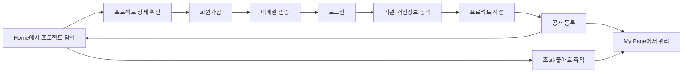
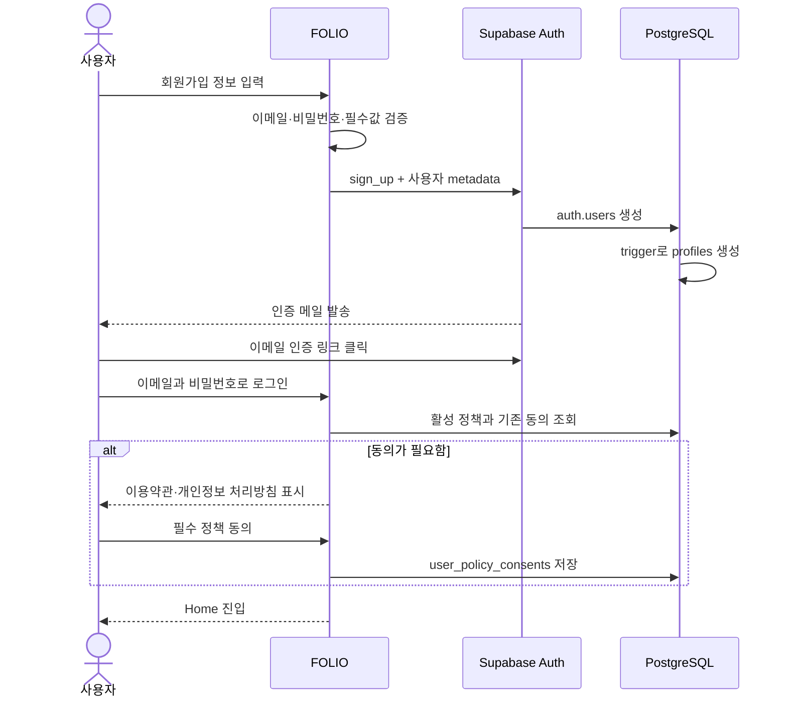
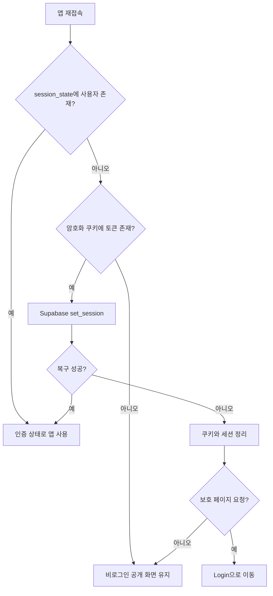
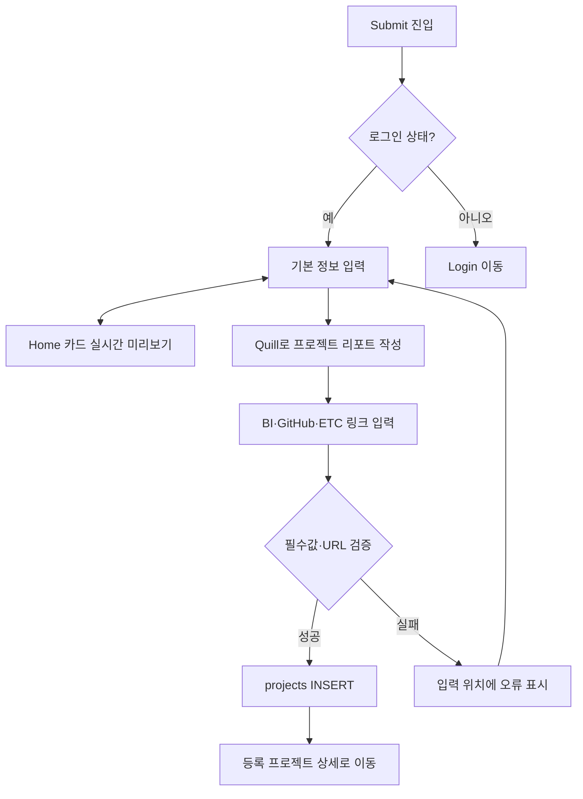
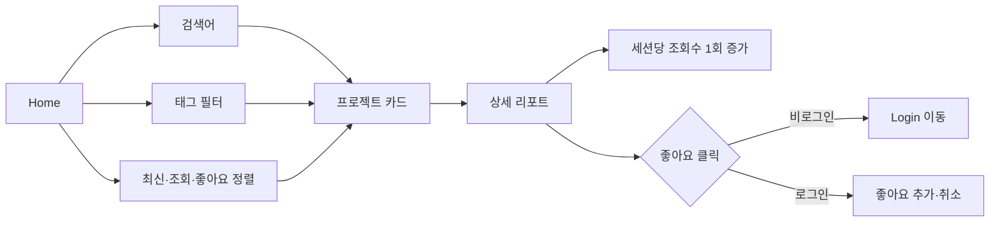
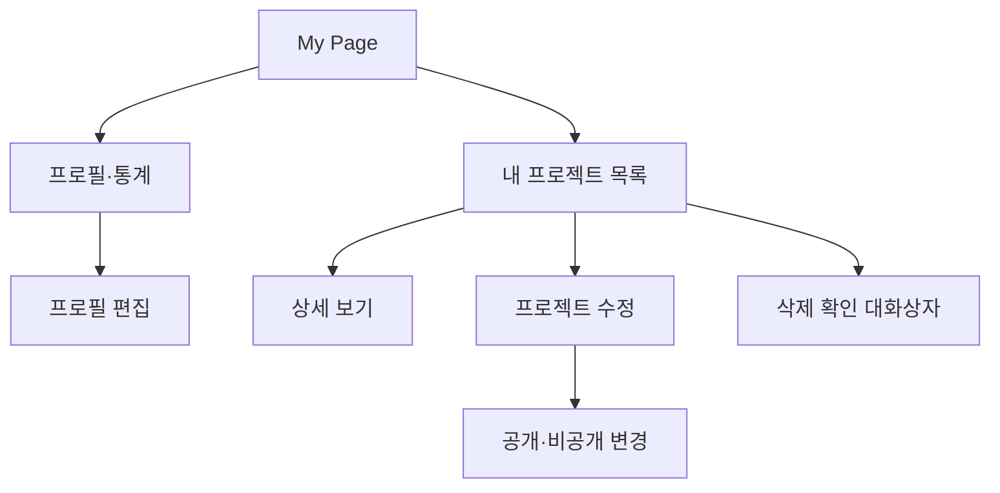

# FOLIO 사용자 플로우

이 문서는 사용자가 FOLIO를 발견하고, 가입하고, 프로젝트를 포트폴리오 자산으로 축적하는 핵심 여정을 설명한다.

## 1. 전체 사용자 여정

## 2. 회원가입과 온보딩

예외 흐름:

- 이미 가입된 이메일이면 재가입 대신 인증 메일 재발송 또는 로그인을 안내한다.
- 인증 메일은 60초 재발송 제한을 둔다.
- 정책 조회 실패 시 온보딩을 우회하지 않고 재시도를 제공한다.

## 3. 로그인 유지와 만료 복구

## 4. 프로젝트 등록

- PC에서는 기본 정보와 카드 미리보기를 2열로, 모바일에서는 1열로 배치한다.
- 리포트는 문제 정의·사용 데이터·분석 과정·핵심 인사이트 구조를 권장한다.
- 본문은 HTML 허용 목록으로 정제한 뒤 저장한다.

## 5. 공개 탐색과 상세

## 6. My Page 관리

프로필과 프로젝트 관리는 하나의 My Page에 통합한다. 기존 `My Portfolio`, `Profile` URL은 호환을 위해 My Page로 리다이렉트한다.

## 7. 권한별 기능

| 기능 | 비로그인 | 로그인 사용자 | 프로젝트 작성자 |
|---|---:|---:|---:|
| 공개 프로젝트 탐색·상세 | 가능 | 가능 | 가능 |
| 조회수 증가 | 가능 | 가능 | 가능 |
| 좋아요 | Login 안내 | 가능 | 가능 |
| 프로젝트 등록 | 불가 | 가능 | 가능 |
| 비공개 프로젝트 조회 | 불가 | 본인 것만 가능 | 가능 |
| 프로젝트 수정·삭제 | 불가 | 본인 것만 가능 | 가능 |
| My Page | 불가 | 가능 | 가능 |
