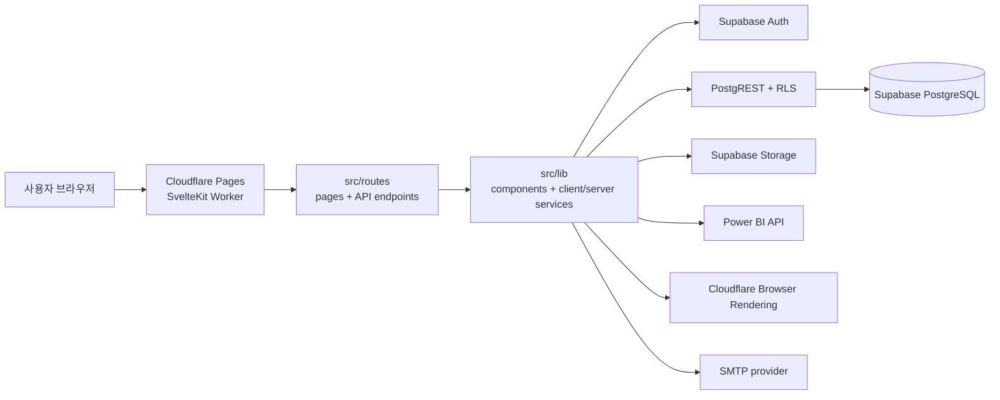

# FOLIO 아키텍처

이 문서는 현재 운영 기준인 루트 SvelteKit 앱의 실행 구조, 모듈 경계, 인증 상태와 데이터 흐름을 설명한다. Streamlit 구현은 레거시 비교·참조용이며 현재 배포 단위가 아니다.

## 1. 시스템 개요

FOLIO는 SvelteKit + Cloudflare Pages runtime + Supabase 기반 데이터 시각화 커뮤니티다. SvelteKit이 라우팅, SSR, 서버 endpoint, 클라이언트 UI를 담당하고, Supabase가 Auth, PostgreSQL, RLS, Storage를 제공한다.



## 2. 코드 계층

```text
src/routes/               # SvelteKit pages, server load, API endpoints
src/lib/components/       # 화면 컴포넌트
src/lib/server/           # 서버 전용 Supabase, Power BI, email, capture helpers
src/lib/*.ts              # client/shared domain logic, formatting, project workflow
src/styles/               # 전역 CSS token과 화면별 style modules
static/                   # 이미지, 폰트, robots.txt
scripts/                  # smoke, capture, performance, audit scripts
tests/uiux/               # Playwright UI tests
tests/unit/               # Node unit tests for shared logic
supabase/                 # schema and RLS source of truth
```

| 계층 | 책임 | 금지되는 책임 |
|---|---|---|
| `src/routes/*/+page.svelte` | 화면 조합, 사용자 상호작용, route-level UI state | secret 접근, RLS 우회 |
| `src/routes/*/+page.server.ts` | SSR data load, server-only read path | 브라우저 전용 API 직접 사용 |
| `src/routes/api/**/+server.ts` | 인증 필요한 mutation, upload, Power BI, thumbnail endpoint | 클라이언트에 private env 반환 |
| `src/lib/components/` | 재사용 UI, 카드, 댓글, editor, form, Power BI viewer | 데이터 접근 정책 결정 |
| `src/lib/server/` | server-only Supabase client, service role, Power BI API, SMTP, capture | browser bundle import |
| `src/lib/*.ts` | 순수 변환, sanitizer, project save orchestration, client API wrappers | 장기 side effect 은닉 |
| Supabase | Auth, RLS, RPC, Storage 정책 | 화면 상태 관리 |

## 3. 실행과 배포

로컬 개발:

```powershell
npm.cmd ci
npm.cmd run dev:managed -- --Port 5174
```

Cloudflare Pages:

```text
Root directory: 비움 또는 repository root
Build command: npm run build
Build output directory: .svelte-kit/cloudflare
```

`svelte.config.js`는 `@sveltejs/adapter-cloudflare`를 사용한다. `wrangler.jsonc`는 Pages output, compatibility date, `nodejs_compat`를 고정한다.

Windows 로컬에서는 plain `npm run dev`가 Wrangler/Miniflare 사용자 프로필 registry에 쓰려다가 `EPERM`을 낼 수 있으므로 `dev:managed`를 기본으로 사용한다.

## 4. 라우팅

SvelteKit 파일 기반 라우팅을 사용한다.

| 경로 | 역할 |
|---|---|
| `/` | 홈, 프로젝트 탐색, 카드 레일 |
| `/projects/[id]` | 프로젝트 상세 |
| `/projects/[id]/edit` | 프로젝트 수정 |
| `/submit` | 프로젝트 등록 |
| `/my` | 마이페이지 |
| `/notifications` | 알림 |
| `/login`, `/signup`, `/reset-password` | 인증 |
| `/onboarding` | 정책 동의 온보딩 |
| `/policy`, `/policy/[type]` | 정책 문서 |
| `/references/powerbi`, `/references/[platform]` | 레퍼런스 |
| `/powerbi` | Power BI 콘텐츠 허브 |

API endpoints:

- `/api/projects/[id]/thumbnail`
- `/api/projects/[id]/thumbnail-capture`
- `/api/projects/[id]/body-image`
- `/api/projects/[id]/powerbi-publish`
- `/api/projects/[id]/powerbi-embed`
- `/api/comments/[id]/email-notification`

## 5. 인증과 권한

- 브라우저 인증은 Supabase client와 public key를 사용한다.
- 서버 mutation은 request token을 다시 확인한 뒤 처리한다.
- 최종 접근 권한은 Supabase RLS가 결정한다.
- `SUPABASE_SERVICE_ROLE_KEY`는 서버 전용이며 클라이언트 bundle에 들어가면 안 된다.
- UI에서 버튼을 숨기는 것은 UX일 뿐 보안 경계가 아니다.

## 6. 데이터와 외부 서비스

- 공개/상세 프로젝트 조회는 Supabase RPC와 table fallback을 함께 고려한다.
- 댓글, 좋아요, 알림은 Supabase RLS 정책과 서버 endpoint 인증을 함께 사용한다.
- 썸네일 업로드는 Supabase Storage public URL을 사용한다.
- 자동 캡처는 Cloudflare Browser Rendering을 우선하고, 로컬 Playwright fallback은 개발 환경 전용이다.
- PBIX 게시와 Embed Token 발급은 Power BI API secret을 서버에서만 사용한다.
- 이메일 알림은 SMTP 설정이 있을 때만 시도하며, 실패가 댓글 작성 자체를 막아서는 안 된다.

## 7. 레거시 경계

`app.py`, `folio_app/`, Python `tests/test_*.py`, `docs/streamlit/`은 Streamlit 원본과 과거 운영 기준을 보존한다. 새 기능, 배포, UI 수정은 기본적으로 루트 SvelteKit 구조에서 진행한다.
