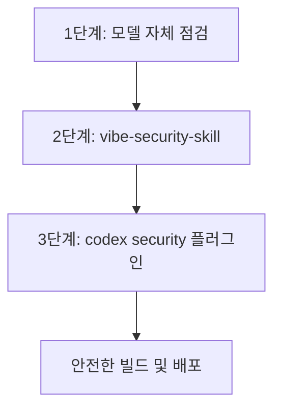

# FOLIO 다층 보안 검증 플레이북 (Security Playbook)

목표: FOLIO 프로젝트의 가용성, 신뢰성, 데이터 무결성을 보장하기 위해 3대 보안 채널을 활용한 다층 보안 검증 프로세스를 수립하고 상시 실행한다.

---

## 3대 보안 검증 체계 (Multi-Layered Security Gates)

FOLIO는 개발, 형상 관리, 빌드 및 배포 전 단계에서 발생할 수 있는 보안 취약점을 차단하기 위해 아래의 **3중 교차 보안 필터**를 운영합니다.



### 1. 1단계: 모델 자체 점검 (AI Model Self-Correction)
*에이전트(모델)가 코드를 생성하고 패치하는 개발 초기 단계에서의 자가 검증 필터입니다.*

- **점검 시점:** 소스 코드 작성/수정 중 및 `replace_in_file` 도구 적용 전후
- **핵심 점검 항목:**
  - **비밀키 서버 격리:** `SUPABASE_SERVICE_ROLE_KEY`, `POWERBI_CLIENT_SECRET`, `SMTP_PASSWORD` 등의 민감한 환경 변수가 클라이언트 코드(`.svelte` 파일, `src/lib/server`가 아닌 브라우저 런타임용 모듈)에 노출되거나 하드코딩되었는지 체크.
  - **입력값 검증 및 위생 처리(Sanitization):** 사용자 입력값(특히 HTML 에디터 본문 등)이 출력 시 XSS 취약점을 유발하지 않도록 저장/출력 전 `sanitizeProjectHtml()` 적용 여부를 스스로 확인.
  - **권한 경계 확인:** UI 단에서 버튼을 숨기는 불완전한 방식이 아닌, Supabase의 Row Level Security(RLS) 및 API 엔드포인트 토큰 검증 로직이 설계와 일치하는지 교차 점검.

### 2. 2단계: vibe-security-skill (형상 관리 및 깃허브 푸시 전 점검)
*Vibe 에이전트 구동 환경의 전용 보안 진단 스킬(`.vibe/skills`)을 통한 형상 관리 관점의 통제 필터입니다.*

- **점검 시점:** 로컬 Git 커밋 및 GitHub 원격 저장소 푸시(Push) 직전
- **핵심 점검 항목:**
  - **Git 추적 예외(Leak) 방지:** `.env`와 같은 자격 증명 파일이 실수로 Git 인덱스에 추가되어 원격 GitHub 리포지토리에 푸시되는 현상 원천 차단.
  - **Secret 노출 탐지:** 커밋하려는 변경 이력(Diff) 또는 로컬 작업 파일에 실제 외부 API 토큰, 패스워드, 클라우드 자격 증명이 포함되어 있는지 `vibe-security-skill` 전용 스캔 엔진으로 탐지.

### 3. 3단계: codex security 플러그인 (정적 코드 분석 및 런타임 보안 빌드 스캔)
*IDE 플러그인 및 자동화된 빌드 단계에서 구동되는 정밀 정적 분석(Static Analysis) 및 스모크 보안 스캔 필터입니다.*

- **점검 시점:** 로컬 빌드 및 통합 테스트(`npm run verify`) 수행 시 자동 실행
- **핵심 점검 항목:**
  - **클라이언트 번들 스캔:** 빌드 결과물(Cloudflare Pages 업로드용 에셋 번들 `.svelte-kit/cloudflare/_app/*`, `build/client/*`) 전체를 대상으로, 실제 설정된 로컬 `.env` 환경 변수 값이 번들 소스 내에 평문으로 치환되어 유입되었는지 정밀 탐지. (실행 스크립트: `npm run smoke:security`)
  - **API 엔드포인트 접근 제어:** 비로그인/익명 사용자가 권한이 필요한 업로드/게시/메일 발송 엔드포인트에 도달했을 때 framework 및 앱 수준에서 401/403 등으로 적절히 거부하는지 확인.
  - **WAF 연계 확인:** 429 Too Many Requests(Rate Limit) 등 인프라 레벨 차단 발생 시 클라이언트가 이를 매끄럽게 핸들링하여 사용자에게 친절한 가이드를 제공하는지 확인.

---

## 보안 점검 프로세스 가이드라인 (Standard Operating Procedure)

개발자와 AI 에이전트는 코드 수정 후 배포하기 전, 아래의 **SOP**에 따라 보안을 점검하고 그 결과를 기록해야 합니다.

### 1단계: 모델 자가 점검 및 코드 작성
- 서버 전용 비밀키가 클라이언트 영역으로 새지 않았는지 논리적 흐름 검토.
- 입력값에 대한 유효성 검사 및 살균(Sanitizer) 로직 확인.

### 2단계: 로컬 샌드박스 보안 스캔 (`vibe-security-skill`)
- 로컬 커밋 전에 `vibe-security-skill`을 기동하여 현재 변경분 및 미추적 파일 점검.
- 비밀키 자가 노출이 감지되면 즉시 커밋을 중단하고 원본 환경 변수를 `.env` 등으로 안전하게 격리.

### 3단계: 통합 보안 검증 및 빌드 스캔 (`codex security`)
- 터미널을 열고 다음의 통합 검증 명령을 실행하여 정적 분석 및 번들 누출 테스트를 통과하는지 확인:
  ```powershell
  # 정적 분석 및 보안 번들 스캔(smoke:security), Supabase 계약 검증(smoke:supabase) 일괄 수행
  npm run verify
  ```
- 특히 `smoke:security`가 번들 파일 전체를 검색하여 빌드 산출물의 완벽한 보완 무결성을 승인했는지 최종 출력 로그를 대조합니다.

---

## 4. 공식 MCP 보안 도구 연동 (Snyk MCP Server)

AI 에이전트(Gemini 등)가 프로젝트의 의존성 패키지와 소스 코드를 실시간으로 정적 분석(SAST) 및 보안 취약점 스캔을 수행할 수 있도록, 공식 Snyk MCP Server를 연동하여 사용할 수 있습니다.

### 1단계: Snyk API 토큰 발급
1. [Snyk 공식 웹사이트](https://snyk.io/)에 로그인합니다.
2. 우측 상단 프로필 이미지 클릭 ➡️ **Account Settings**로 진입합니다.
3. **API Token** 섹션에서 개인 API Token을 확인하고 복사해 둡니다.

### 2단계: MCP 설정 파일 구성
에이전트 클라이언트 환경(VS Code Cline 확장 또는 Claude Desktop 등)의 MCP 설정 파일(`claude_desktop_config.json` 등)에 아래 서버 구성을 추가합니다.

```json
{
  "mcpServers": {
    "snyk": {
      "command": "npx",
      "args": [
        "-y",
        "github:snyk-labs/mcp-server-snyk"
      ],
      "env": {
        "SNYK_TOKEN": "발급받은_SNYK_API_토큰_값"
      }
    }
  }
}
```

### 3단계: 연동 후 사용 가이드
설정 파일을 저장한 뒤 클라이언트를 재시작하면, 에이전트(모델)가 자동으로 Snyk 분석 도구를 인식합니다. 다음과 같은 음성 또는 텍스트 명령을 통해 보안 스캔을 즉시 가동할 수 있습니다.
- *"이 프로젝트의 package.json 종속성에 알려진 보안 취약점이 있는지 Snyk으로 분석해줘"*
- *"현재 리포지토리 소스 코드 전체를 대상으로 Snyk SAST 보안 점검을 돌리고 취약점 리포트를 작성해줘"*

---

## 비상 대응 및 유출 시 조치 요령 (Incident Response)

만약 3중 필터가 누락되어 깃허브나 배포 서버에 실제 비밀키가 유출된 정황이 발견될 경우, 즉시 아래의 비상 런북을 따릅니다:

1. **토큰 즉시 무효화 (Revoke First):**
   - 유출이 의심되는 즉시 Supabase Dashboard, Cloudflare Dashboard, 혹은 SMTP 공급자에서 해당 Secret Key를 폐기(Revoke)하고 새 키를 발급합니다.
2. **원격 저장소 정리 및 커밋 강제 제거:**
   - Git 이력에서 민감한 정보를 완전히 제거하기 위해 `git filter-repo` 또는 `BFG Repo-Cleaner`를 사용하여 Git 히스토리 전체에서 해당 값을 완전히 삭제한 후 강제 푸시(Force Push)합니다.
3. **환경 변수 재등록:**
   - 유출된 구버전 환경 변수를 새롭게 교체하여 Cloudflare Pages 환경 변수 및 GitHub Secrets에 재등록하고, 배포 파이프라인을 재가동합니다.
